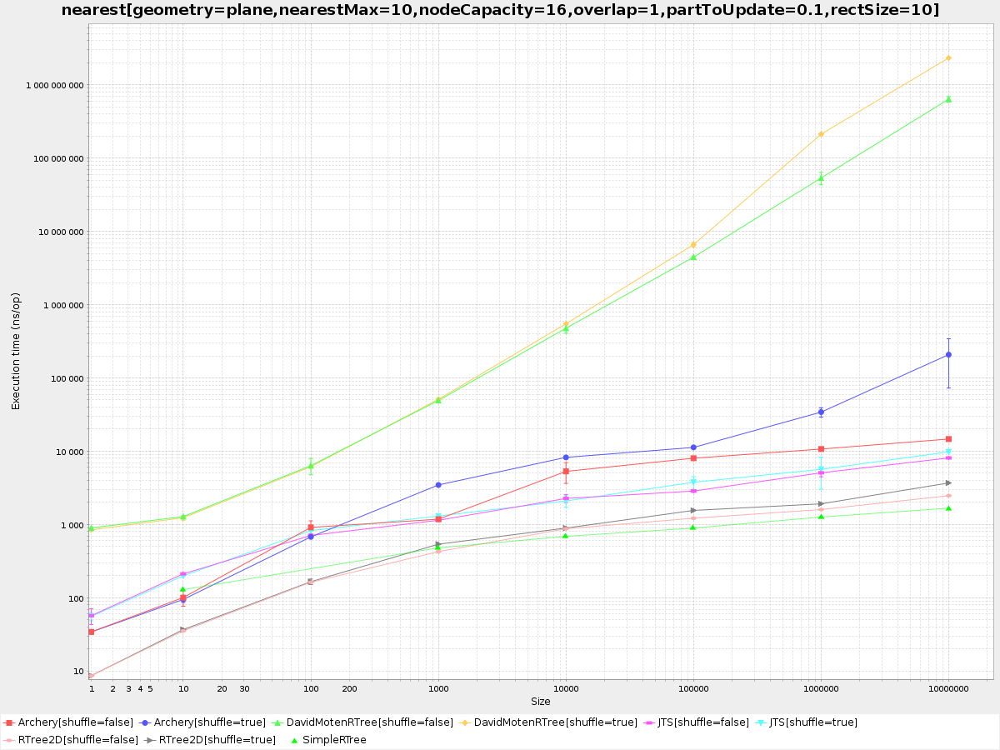

## Simple RTree

Simple RTree is a blazingly fast and GC friendly RTree. It handles 1 Million points in 1.2 microseconds for nearest point search
(measured in an i7 with 16Gb of RAM). It is GC friendly, queries require 0 allocations.
Building the index requires exactly 8 allocations and approximately 40 bytes per coordinate.
That is, an index for 1 million points requires approximately 40Mb in the heap.

To achieve this speed, the index has three restrictions. It is static, once built it cannot be changed.
It only accepts points coordinates, no bboxes, lines or ids. And it only accepts (for now) one query, closest point to a given coordinate.

Beware, to achieve top performance one of the hot functions has been rewritten in assembly.
Library works in x86 but it probably won't work in other architectures. PRs are welcome to fix this deficiency.

### Installation

    go get github.com/furstenheim/SimpleRTree

### Basic Usage

The format of the points is a single array where each two coordinates represent a point

    import "SimpleRTree"
    points := []float64{0.0, 0.0, 1.0, 1.0} // array of two points 0, 0 and 1, 1

    fp := SimpleRTree.FlatPoints(points)
    r := SimpleRTree.New().Load(fp)
    closestX, closestY, distanceSquared := r.FindNearestPoint(1.0, 3.0)
    // 1.0, 1.0, 4.0

### Documentation
To access the whole documentation you can access the following [link](https://godoc.org/github.com/furstenheim/SimpleRTree).

### Benchmark. CPU

These are the benchmarks for finding the nearest point once the index has been built.

    BenchmarkSimpleRTree_FindNearestPoint/10-4      	10000000	       124 ns/op
    BenchmarkSimpleRTree_FindNearestPoint/1000-4    	 3000000	       465 ns/op
    BenchmarkSimpleRTree_FindNearestPoint/10000-4   	 2000000	       670 ns/op
    BenchmarkSimpleRTree_FindNearestPoint/100000-4  	 2000000	       871 ns/op
    BenchmarkSimpleRTree_FindNearestPoint/200000-4  	 2000000	       961 ns/op
    BenchmarkSimpleRTree_FindNearestPoint/1000000-4 	 1000000	      1210 ns/op
    BenchmarkSimpleRTree_FindNearestPoint/10000000-4         	 1000000	      1593 ns/op

### Comparison with other libraries

It is hard to find good comparison of RTrees. Best available can be found at [Sizmek](https://github.com/Sizmek/rtree2d) which gathers benchmarks for RTrees in Java and Scala.
 According to that benchmark query times for 10M points vary from 2.7 microseconds to over 100 microseconds, so SimpleRTree performs fairly better.
 Performance is even comparable with [Boost](https://www.boost.org/doc/libs/1_64_0/libs/geometry/doc/html/geometry/spatial_indexes/introduction.html)
 for trees using R*-tree algorithm the performance is of 0.12s for 100k searches (i.e. 1.2 microseconds per search), same as SimpleRTree.

 We have added SimpleRTree to the following chart of Java libraries (source Sizmek).

 
